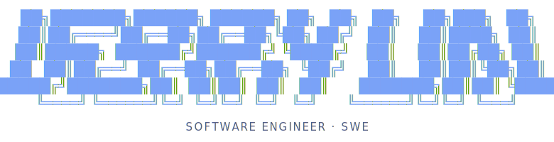

### CS + Business Double Degree @ Waterloo & Laurier
**Building at the intersection of AI, Finance, and Scalable Platforms**

📍 Thornhill, Ontario, Canada

---

## 📊 Statistics Dashboard

<table>
  <tr>
    <td width="50%" align="center">
      
    </td>
    <td width="50%" align="center">
      
    </td>
  </tr>
  <tr>
    <td width="50%" align="center">
      
    </td>
    <td width="50%" align="center">
      
    </td>
  </tr>
</table>

---

## 👋 About Me
I am a Computer Science (BCS) and Business Administration (BBA) double degree student at the **University of Waterloo** and **Wilfrid Laurier University**. I build production-grade data pipelines, fine-tune large language models, and ship full-stack financial and developer tools end to end — from model training to deployment.

* 🔭 **Currently building:** AI agents, LLM fine-tuning pipelines, and quantitative trading tools.
* 🌱 **Currently learning:** distributed training, retrieval-augmented generation, and low-level performance optimization.
* 🔍 **Currently seeking:** SWE / ML Engineer Co-op opportunities for **Fall 2026**.
* ⚡ **Fun Fact:** I fine-tuned a 6.7B parameter LLM on my laptop and Kaggle just to solve LeetCode problems faster.

---

## 🛠️ Technical Skills

<b>💻 Languages & Core Dev</b>

  
  
  
  
  
  
  
  
  

<b>🤖 Machine Learning & AI</b>

  
  
  
  
  
  
  
  

<b>🌐 Frameworks & Platforms</b>

  
  
  
  
  
  
  

<b>⚙️ Cloud, Data & DevOps</b>

  
  
  
  
  
  
  
  
  

---

## 🚀 Featured Projects

### 🔀 [tokenmaxxing](https://github.com/jerrylin-23/tokenmaxxing)
    
* **Agentic Handoff Portal:** macOS desktop + CLI bridge that lets you plan on ChatGPT Web and execute with a local CLI agent (Codex, Claude Code, Antigravity).
* **MCP over the Wire:** Exposes a local Model Context Protocol server securely over Tailscale Funnel so remote chat sessions can drive on-device tooling.
* **Token Efficiency:** Offloads heavy planning to the browser frontend, reserving local agent context for execution.

### 🧠 [DeepSeek LeetCode Fine-Tuning](https://github.com/jerrylin-23/DeepSeek-LeetCode-Oriented-Training)
    
* **Performance Leap:** Fine-tuned DeepSeek-Coder **6.7B** on **2,400** curated problems via QLoRA.
* **Result-Oriented:** Achieved a **+42% accuracy boost** overall and **+214% on hard problems** through domain-specific data curation.
* **Local Deployment:** Built an evaluation harness with sandboxed execution, merged LoRA adapters, and exported to GGUF for local Ollama inference.

### 🤖 [Agentic GitHub PR Reviewer](https://github.com/jerrylin-23/gh-pr-reviewer)
   
* **TUI Dashboard:** Built a terminal interface orchestrating local AI agents for automated PR code reviews.
* **Non-Blocking UI:** Used `asyncio` workers so the interface stays responsive during long AI review cycles.
* **Security First:** Integrated native `gh` CLI auth (no raw API keys stored) and staged reviews locally so comments are never posted without explicit confirmation.

### 📈 [Alpha Radar](https://ict-buy-the-dip.onrender.com/)
   
* **Real-time Scanning:** Vectorized pandas engine detecting institutional support levels (FVGs, equal highs/lows) across **500+** tickers.
* **Backtesting Engine:** Custom simulator evaluating **700+** historical setups across NVDA, GOOGL, and AAPL, hitting a simulated **74% win rate**.
* **Dynamic Visuals:** Deployed with WebSocket data streams rendering interactive TradingView charts.

### 📊 [Gemini Portfolio Insights](https://ai-portfolio-analyzer.onrender.com)
   
* **Multi-Model Pipeline:** Gemini-to-Gemini workflow where the first model digests macroeconomic context and the second runs portfolio analysis.
* **Calendar Integration:** Auto-syncs market events (FOMC, CPI, NFP) and earnings schedules for **30+** megacap equities.
* **Reliability:** Built a 2-key rotation system with model fallback, reducing failed request rates by **90%**.

### 📱 [IntelliCal](https://www.youtube.com/shorts/UCFAg8bHJJc)
   
* **AI Nutrition:** Gemini vision pipeline parsing meal photos into structured JSON with **~88% accuracy** and zero parsing crashes.
* **Gamified Retention:** Forest gamification system syncing real-time user progress to Supabase/PostgreSQL.

---

## 💼 Professional Experience

### 🚘 Software Engineer @ AutoTrader
*Toronto, ON (Hybrid) — Sept 2025 – Dec 2025 · Jan 2025 – Apr 2025*

* **Data Scale:** Scaled AWS Python pipelines to crawl **500K+** URLs, cutting runtime from hours to minutes via parallel workers + Redis caching.
* **Stakeholder Analytics:** Built weekly ETL into PostgreSQL and Tableau dashboards used by **20+** leadership and marketing stakeholders.
* **ML Modeling:** Built a scikit-learn scoring engine ranking **20K+** articles to prioritize content strategy.

### 🎟️ Software Engineer @ HeadsUp Group & iVirtual
*Toronto, ON — Jan 2024 – Apr 2024*

* **Database Consolidation:** Dockerized AWS ETL pipelines merging 4 siloed databases, saving **300+** engineering hours/year.
* **Notification Engine:** Built a SendGrid pipeline with queued retries for an NHL Kraken rewards pilot, sustaining **80%+** weekly engagement.
* **User Segmentation:** Built a pipeline clustering **100+** user profiles by behavior for personalized rewards delivery.

---

## 📈 Contribution Graph

  

---

## 📫 Let's Connect!

  
  
  

<!-- Keywords: Machine Learning Engineer · LLM Fine-Tuning · QLoRA · PyTorch · RAG · AI Agents · Full-Stack Developer · Python · TypeScript · React · Next.js · FastAPI · Data Engineering · AWS · Docker · Quantitative Finance · SWE Co-op Fall 2026 -->
