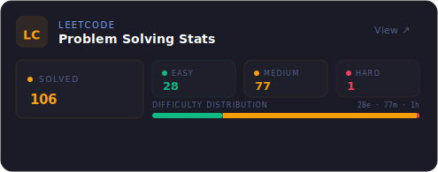

# 🧑‍💻 Jerry Lin  
### CS + Business Double Degree @ Waterloo & Laurier
**Building at the intersection of AI, Finance, and Scalable Platforms**

📍 Thornhill, Ontario, Canada

---

## 📊 Statistics Dashboard

  
  

  
  

---

## 👋 About Me
I am a Computer Science (BCS) and Business Administration (BBA) double degree student at the **University of Waterloo** and **Wilfrid Laurier University**. I love building production-grade data pipelines, fine-tuning LLMs, and crafting full-stack financial/developer tools.

* 🔍 **Currently seeking:** SWE / ML Engineer Co-op opportunities for **Fall 2026**.
* ⚡ **Fun Fact:** I fine-tuned a 6.7B parameter LLM on my laptop and Kaggle just to help me solve LeetCode problems faster.

---

## 🛠️ Technical Skills

<b>💻 Languages & Core Dev</b>

  
  
  
  
  
  
  
  

<b>🤖 Machine Learning & AI</b>

  
  
  
  
  

<b>🌐 Frameworks & Platforms</b>

  
  
  
  
  
  

<b>⚙️ Cloud, Data & DevOps</b>

  
  
  
  
  
  
  

---

## 🚀 Featured Projects

### 🧠 [DeepSeek LeetCode Fine-Tuning](https://github.com/jerrylin-23/DeepSeek-LeetCode-Oriented-Training)
    
* **Performance Leap:** Fine-tuned DeepSeek-Coder **6.7B** on **2,400** curated problems via QLoRA.
* **Result-Oriented:** Achieved a **+42% accuracy boost** overall, and **+214% accuracy on hard problems** through domain-specific training data curation.
* **Local Deployment:** Built an evaluation harness with sandboxed execution, merged LoRA adapters, and exported to GGUF for local Ollama usage.

### 🤖 [Agentic GitHub PR Reviewer](https://github.com/jerrylin-23/gh-pr-reviewer)
   
* **TUI Dashboard:** Developed a terminal user interface orchestrating local AI agents for automated PR code reviews.
* **Non-Blocking UI:** Used `asyncio` for non-blocking workers so the terminal interface remains responsive during long AI review cycles.
* **Security First:** Integrated native `gh` CLI auth (no raw API keys stored) and staged reviews locally so comments are never posted without explicit user confirmation.

### 📈 [Alpha Radar](https://ict-buy-the-dip.onrender.com/)
   
* **Real-time Scanning:** Vectorized pandas scanning engine to detect institutional support levels (FVGs, equal highs/lows) across **500+** tickers.
* **Backtesting Engine:** Designed custom simulator evaluating **700+** historical trade setups across NVDA, GOOGL, and AAPL, achieving a simulated **74% win rate**.
* **Dynamic Visuals:** Deployed with WebSocket data streams rendering interactive TradingView charts.

### 📊 [Gemini Portfolio Insights](https://ai-portfolio-analyzer.onrender.com)
   
* **Multi-Model Pipeline:** Implemented a Gemini-to-Gemini workflow where the first model digests macroeconomic context and the second executes portfolio analysis.
* **Calendar Integration:** Auto-syncs market events (FOMC, CPI, NFP) and earnings schedules for **30+** megacap equities.
* **Reliability:** Built a 2-key rotation system with model fallback, reducing failed request rates by **90%**.

### 📱 [IntelliCal](https://www.youtube.com/shorts/UCFAg8bHJJc)
   
* **AI Nutrition:** Designed a Gemini vision pipeline parsing meal photos into structured JSON with **~88% accuracy** and zero parsing crashes.
* **Gamified Retention:** Built a forest gamification system syncing real-time user progress to Supabase/PostgreSQL.

---

## 💼 Professional Experience

### 🚘 **Software Engineer** @ **AutoTrader**
*Toronto, ON (Hybrid) | Sept 2025 – Dec 2025 | Jan 2025 – Apr 2025*

<b>View Role & Achievements</b>

* **Data Scale:** Scaled Python data pipelines on **AWS** to crawl and analyze **500K+** dynamic URLs, leveraging parallel workers and Redis caching to reduce runtime from hours to minutes.
* **Stakeholder Analytics:** Merged search engine APIs into weekly ETL processes, storing results in **PostgreSQL** and building **Tableau** dashboards used by **20+** leadership and marketing stakeholders.
* **ML Modeling:** Built a statistical scoring engine evaluating **20K+** articles using scikit-learn regression models to prioritize content strategy.
* **Reliability:** Implemented retry logic, exponential backoff, and circuit breakers for external API integrations, backed by structured JSON logging.

### 🎟️ **Software Engineer** @ **HeadsUp Group & iVirtual**
*Toronto, ON | Jan 2024 – Apr 2024*

<b>View Role & Achievements</b>

* **Database Consolidation:** Containerized (Docker) ETL pipelines on AWS to merge **4** siloed databases, saving the engineering team **300+** hours/year.
* **Notification Engine:** Developed a SendGrid notification pipeline with queued retries for an NHL Kraken rewards pilot, maintaining **80%+** weekly engagement.
* **User Segmentation:** Built a pipeline clustering **100+** user profiles by behavioral metrics for personalized rewards delivery.

## 📫 Let's Connect!

  
  
  

